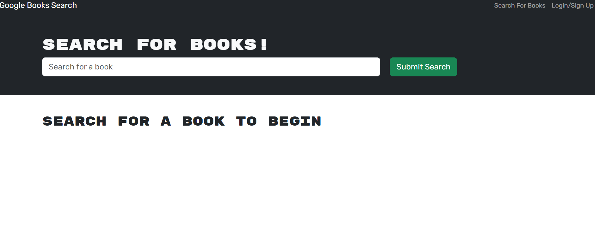
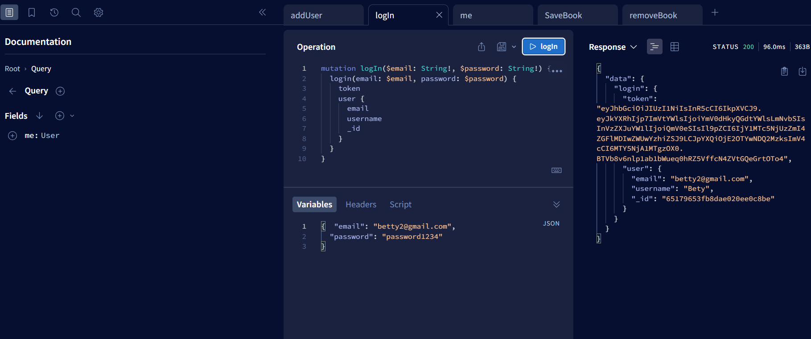
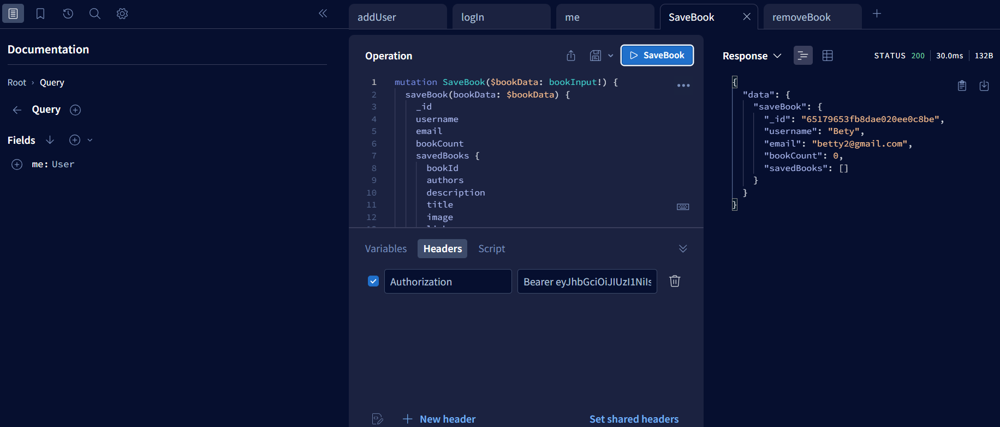

# Book Search Engine

## My Task

My assignment was inspired by the modern scope of where websites are now and are continue to be headed as technology grows: Data and User demands. Personalization for the user is huge and has become a main ingredient of Real-World Web Development in today's climate for technology. Performance is evolving day by day.

With the use of a starter code with a fully functioning Google Books API search engine put together with the use of a RESTful API, and refactored to be a GraphQL API built with Apollo Server. I have built this application using the MERN stack with a React front end, a database with MongoDB, and a server and API ran by Node.js/Express.js. Users can save book searches to the back end.

I have completed the assignment doing the following:

1. Set up an Apollo Server using GraphQL queries and mutations to fetch and modify data, and replaced the existing RESTful API.

2. Modified the existing authentication middleware and it works in the context of a GraphQL API.

3. Created an Apollo Provider and now requests can communicate with an Apollo Server.

4. Deployed my application to Heroku with a MongoDB database using MongoDB Atlas. 


## User Story

```md
AS A lover of books
I WANT to search for any new books that are available to read
SO THAT I can curate a list of my favorites to read soon
```

## Acceptance Criteria

```md
GIVEN a search engine for books 
WHEN I open up the search engine
THEN I a menu with the options Search for Books and Login/Signup appears and an input field is presented to allow searches for books
WHEN I click on the Search for Books menu option
THEN I am presented with an input field to search for books and a  button for submit
WHEN I am not logged in searching terms in the input field and clicking the submit button
THEN presents to me several search results, including the book’s title, author, description, and image for each item along with a link to that book on the Google Books site
WHEN I click on the Login/Signup menu option
THEN a modal appears on the screen with a toggle between the option to log in or sign up
WHEN the toggle is set to Signup
THEN inputs for username, email address, and password are displayed followed by a signup button
WHEN the toggle is set to Login
THEN I am presented with inputs for an email address and password followed by the login button
WHEN a valid email address and created password is entered upon clicking the signup button
THEN my user account is created and I am logged in
WHEN I enter my account’s email address and password into the login modal
THEN I the modal closes and I am logged in
WHEN logged in to the site
THEN the menu options Search for Books, see my saved books, and Logout are presented
WHEN I am logged in searching terms in the input field and clicking the submit button
THEN presents to me several search results, including the book’s title, author, description, and image for each item along with a link to that book on the Google Books site as well as a button to save a book to my account
WHEN I click on the Save button on a book
THEN that book’s information is saved to my account
WHEN I click on the option to see my saved books
THEN all of the books I have saved to my account are viewable, each featuring the book’s title, author, description, image, and a link to that book on the Google Books site and a button to remove a book from my account
WHEN I click on the Remove button on a book
THEN that book is deleted from my curated book list
WHEN I click on the Logout button
THEN I am logged out of the site a menu with the options Search for Books and Login/Signup and an input field to search for books and a submit button are presented again  
```

## Mock-Up


The following animation showcases a functioning site that was provided to me as a model to be used for guidance during the development stage:


The user can save books by clicking "Save This Book!" under each search result, as shown in the following animation:


A user can view their saved books on a separate page, as shown in the following animation:


## Getting Started

I have refactored the API to use GraphQL on the back end and added some functionality to the front end in order for this application to use a GraphQL API. The following sections contain details about the files I needed to modify on the back end and the front end.

**Note**: The following structure was the standard and guidelines for how my files and application structure was to be constructed.

### Back-End Specifications

I have completed the following tasks in each of these back-end files:

* `auth.js`: Updated the auth middleware function to work with the GraphQL API.

* `server.js`: Implemented the Apollo Server and applied it to the Express server as middleware.

* `Schemas` directory:

  * `index.js`: Exported my typeDefs and resolvers.

  * `resolvers.js`: Defined the query and mutation functionality to work with the Mongoose models.

  **Hint**: Used the functionality in the `user-controller.js` as a guide.

  * `typeDefs.js`: Defined the necessary `Query` and `Mutation` types:

    * `Query` type:

      * `me`: Which returns a `User` type.
  
    * `Mutation` type:

      * `login`: Accepts an email and password as parameters; returns an `Auth` type.

      * `addUser`: Accepts a username, email, and password as parameters; returns an `Auth` type.

      * `saveBook`: Accepts a book author's array, description, title, bookId, image, and link as parameters; returns a `User` type. (Look into creating what's known as an `input` type to handle all of these parameters!)

      * `removeBook`: Accepts a book's `bookId` as a parameter; returns a `User` type.

    * `User` type:

      * `_id`

      * `username`

      * `email`

      * `bookCount`

      * `savedBooks` (This will be an array of the `Book` type.)

    * `Book` type:

      * `bookId` (Not the `_id`, but the book's `id` value returned from Google's Book API.)

      * `authors` (An array of strings, as there may be more than one author.)

      * `description`

      * `title`

      * `image`

      * `link`

    * `Auth` type:

      * `token`

      * `user` (References the `User` type.)

### Front-End Specifications

I have created the following front-end files:

* `queries.js`: This holds the query `GET_ME`, which executes the `me` query set up using Apollo Server.

* `mutations.js`:

  * `LOGIN_USER` that executes the `loginUser` mutation set up using Apollo Server.

  * `ADD_USER` that executes the `addUser` mutation.

  * `SAVE_BOOK` that executes the `saveBook` mutation.

  * `REMOVE_BOOK` that executes the `removeBook` mutation.

Additionally, I have completed the following tasks in each of these front-end files:

* `App.jsx`: Created an Apollo Provider to make every request work with the Apollo Server.
 
* `SearchBooks.jsx`:

  * Used the Apollo `useMutation()` Hook to execute the `SAVE_BOOK` mutation in the `handleSaveBook()` function instead of the `saveBook()` function imported from the `API` file.

  * Made sure to keep the logic for saving the book's ID to state in the `try...catch` block!

* `SavedBooks.jsx`:

  * Removed the `useEffect()` Hook that set the state for `UserData`.

  * Instead, I used the `useQuery()` Hook to execute the `GET_ME` query on load and saved it to a variable named `userData`.

  * Used the `useMutation()` Hook to execute the `REMOVE_BOOK` mutation in the `handleDeleteBook()` function instead of the `deleteBook()` function that was imported from `API` file. (Made sure to keep the `removeBookId()` function in place!)

* `SignupForm.jsx`: Replaced the `addUser()` functionality imported from the `API` file with the `ADD_USER` mutation functionality.

* `LoginForm.jsx`: Replaced the `loginUser()` functionality imported from the `API` file with the `LOGIN_USER` mutation functionality.

## Review 

The following has been placed here to meet requirements for review:


Refer to this link [Heroku Deployed Application]() to view and explore the application and functions on deployed site on Heroku

Refer to this link [GitHub Repository](https://github.com/TheKhalidGibson/BookSearchEngine) to view and explore the GitHub repo for this assignment


## Screenshots

The following images reflect the functionality and final results of development for this deployed application:

This is an image showing the landing page for the book search


This is an image showing graphQL routes being hit


This is an image showing graphQL routes being hit

